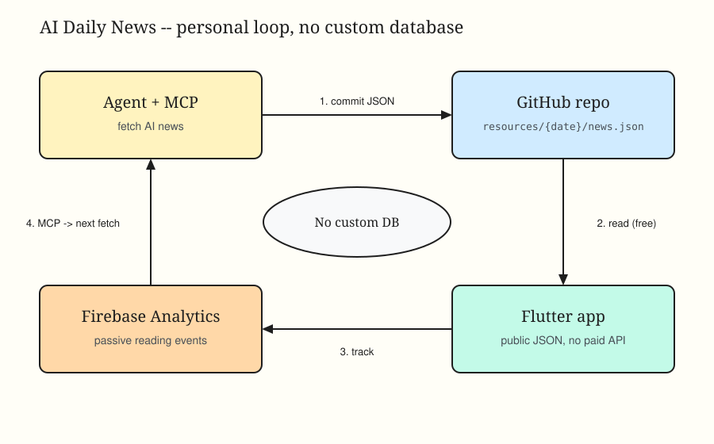

# AI Daily News

A personal, free-to-run Flutter reader for daily AI news.

An agent gathers stories with MCP and publishes them as public JSON on GitHub. The app reads that JSON directly — no paid news API. Reading is tracked passively in Firebase Analytics. The same agent later pulls those signals through MCP and adjusts what it fetches next.

There is no custom database and no recommendation server. Personalization is a thin loop: **read quietly → inspect behavior → pick better news tomorrow**.



## Loop

1. **Agent + MCP** finds AI news and writes `resources/{date}/news.json`.
2. **GitHub** hosts that JSON in public. The app loads it for free (bundled assets in development; raw GitHub when remote).
3. **Flutter app** is a reader only. It does not score, like, or vote. Passive events: `article_impression`, `article_open`, `article_read`, `original_link_click`, `article_reopen`.
4. **Agent + MCP** reads those events from Analytics and uses them to improve the next issue. No extra datastore.

## Repo

| Path | Role |
| --- | --- |
| `resources/` | Daily issues (`news.json`, `cover.svg`) |
| `ai_daily_news/` | Flutter app (iOS / Android) |
| `AGENTS.md` | Agent working rules |
| `ai_daily_news/doc/ANALYTICS_TRACKING.md` | Event contract |

## Run

```bash
cd ai_daily_news
flutter pub get
flutter run
```
